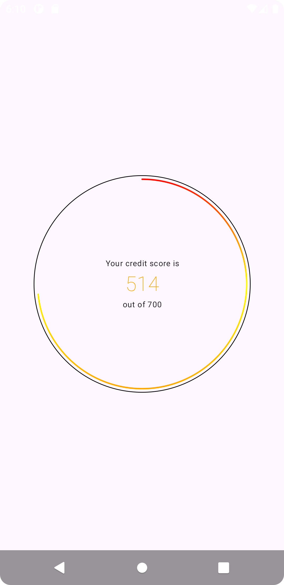

# DriveScoreTest

This is an Android application that displays a user's credit score in a circular progress bar.

## Project Structure

The project is a single-module Android application with the code organized by feature. The main feature is `creditScore`.

- `app/src/main/java/com/ukejee/drivescoretest`
    - `creditScore`: This package contains all the code related to the credit score feature.
        - `data`: This package contains the data layer for the credit score feature.
            - `models`: This package contains the data models for the credit score feature.
            - `repository`: This package contains the repository for the credit score feature, which is responsible for fetching the data.
        - `ui`: This package contains the UI layer for the credit score feature.
            - `compose`: This package contains the Jetpack Compose UI components for the credit score feature.
            - `viewmodel`: This package contains the ViewModel for the credit score feature.
    - `application`: This package contains the application-level code.
    - `ui.theme`: This package contains the UI theme for the application.
    - `MainActivity`: This class contains the main activity for the application.
    - `AppNavigation`: This class contains the navigation for the application.`
- `app/src/test`: This directory contains unit tests for the application.
- `app/src/debug`: This directory contains resources for the debug build, including a mock JSON response for the credit score API.

## Technical Decisions

- **100% Kotlin & Jetpack Compose**: The application is written entirely in Kotlin and uses Jetpack Compose for the UI. This allows for a more modern and declarative approach to building the UI.
- **MVVM Architecture**: The application follows the Model-View-ViewModel (MVVM) architecture pattern. This separates the UI from the business logic, making the code more testable and maintainable.
- **Koin for Dependency Injection**: The application uses Koin for dependency injection. This makes it easy to provide dependencies to the different parts of the application.
- **Flows & Coroutines**: The application uses Flows and coroutines to handle all the apps asynchronous operations.
- **Retrofit for API Calls**: The application uses retrofit to make API calls. 
- **Mockk**: The application makes use of Mockk to make mocks in it's unit tests.
- **Repository Pattern**: The application uses the repository pattern to abstract the data source. This makes it easy to switch between different data sources, such as a remote API and a local database.

## Recommendation for Further Improvements

If I had more time to work on this application here are some more areas I'd have liked to work on:

- I'd have handling the theming properly for light and dark mode.
- I'd have made the application more accessible by following the accessibility guidelines.
- I'd add some retry logic to the API calls.
